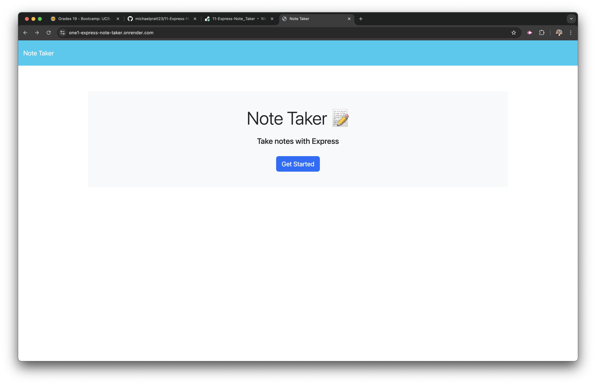
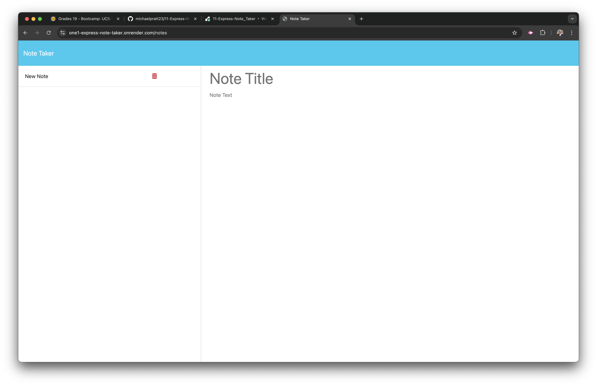

# Express Note Taker

[](https://opensource.org/licenses/MIT)  
A simple and effective note-taking application built using **Node.js** and **Express.js**. This app allows users to write, save, and delete notes seamlessly.

## Deployed Application

Check out the live application here: [Express Note Taker](https://one1-express-note-taker.onrender.com)

## Repository

Explore the source code: [GitHub Repository](https://github.com/michaelpratt23/11-Express-Note_Taker)

---

## Table of Contents

- [Features](#features)
- [Technologies Used](#technologies-used)
- [Installation](#installation)
- [Usage](#usage)
- [Screenshots](#screenshots)
- [License](#license)

---

## Features

- Landing Page: Introduces the app with a "Get Started" button.
- Notes Page:
  - View a list of saved notes.
  - Create new notes by providing a title and text.
  - Save notes to persist them.
  - Delete unwanted notes.
- Fully responsive and user-friendly interface.

---

## Technologies Used

- **Backend:**
  - Node.js
  - Express.js
  - UUID for unique note IDs
- **Frontend:**
  - HTML
  - CSS (Bootstrap 5.2.3 for styling)
  - JavaScript
- **Deployment:**
  - Render (for live hosting)

---

## Installation

To run the app locally, follow these steps:

1. Clone the repository:
   ```bash
   git clone https://github.com/michaelpratt23/11-Express-Note_Taker.git
   ```
2. Navigate to the project directory:
   ```bash
   cd 11-Express-Note_Taker
   ```
3. Install dependencies:
   ```bash
   npm install
   ```
4. Start the application:
   ```bash
   npm start
   ```
5. Open your browser and visit: http://localhost:3001

## Usage

1. Visit the [deployed site](https://one1-express-note-taker.onrender.com).
2. On the landing page, click "Get Started" to navigate to the Notes page.
3. On the Notes page:
   - View saved notes in the left-hand column.
   - Add a new note by entering a title and text in the right-hand column.
   - Save the note by clicking the "Save Note" button.
   - Delete unwanted notes by clicking the trash icon next to them.

---

## Screenshots

### Landing Page



### Notes Page



---

## License

This project is licensed under the [MIT License](https://opensource.org/licenses/MIT).  
You are free to use, modify, and distribute this software under the terms of the license. See the `LICENSE` file for detailed information.
